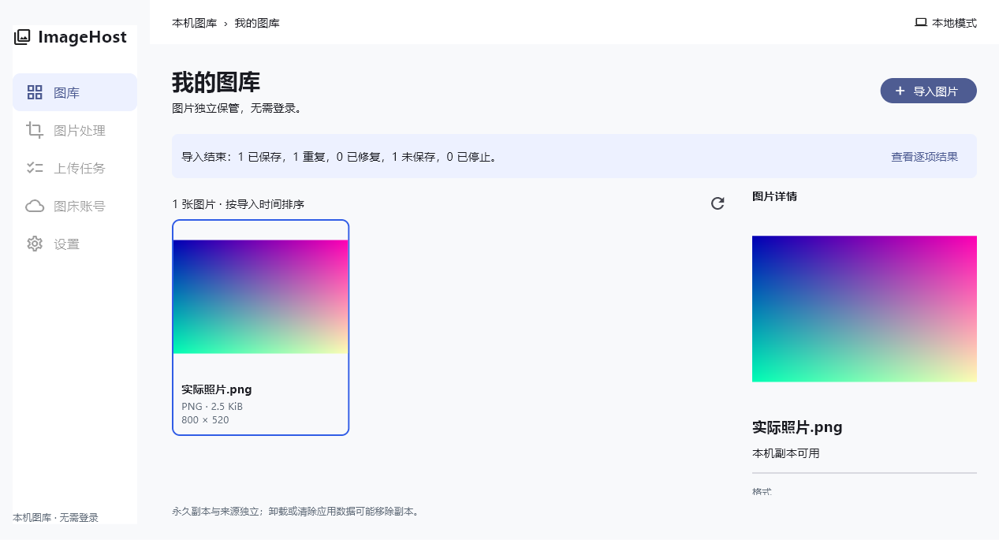

# 第一里程碑实际验收记录

日期：2026-10-04。结论：Windows 的真实本地导入闭环已实现并有文件、数据库、界面及独立进程验证；其余三端已初始化源工程，尚无构建运行证据。本轮不是完整 V1 验收。

## 准备完成

- 完整阅读资源包 `README.md`、`AGENTS.md`、`IMPLEMENTATION.md`。
- 完整阅读 documents 中 `requirements-analysis.md`（需求1.1）、`requirements-review.md`、`unit-test-design.md`、`technology-selection.md`（1.0）、`technology-selection-review.md`。没有重复读取同内容 Word。
- 查看 desktop/mobile 设计规格、implementation notes，以及实际浏览器中的桌面 A 和手机 M1/M2 原型。读取 providers 的 README、Catbox、ImgBB 接入说明。
- 检查真实工作区和平台条件；新约定写入根 `AGENTS.md`。只读保留资源包，不读取、复制、修改旧项目源码和数据。
- 具体差异：手机规格第2条的单调 ID 属于原型机制；生产按 DAT-003 与技术 T-15 采用独立 UUID，仍保证身份稳定和不复用。不影响业务闭环，无其他阻断本轮的业务矛盾。

## 修改文件

| 文件/目录 | 本轮作用 |
| --- | --- |
| 根 `AGENTS.md`、`README.md`、`.gitignore` | 新项目约定、入口、生成产物忽略规则 |
| `app/pubspec.yaml`、`pubspec.lock`、`.metadata`、`analysis_options.yaml` | 新应用、精确依赖及真实生成元信息 |
| `app/lib/main.dart`、`app.dart` | Flutter 启动、Material/Riverpod/go_router 与中文界面 |
| `app/lib/core/` | 来源资源协议、安全错误、文件保管及锁、真实图片检查与缩略图 |
| `app/lib/features/gallery/domain/` | 稳定资产、内容版本、设备副本、结果与状态模型 |
| `app/lib/features/gallery/application/` | 串行批次、逐项结果及停止语义 |
| `app/lib/features/gallery/data/` | Drift schema、真实生成代码、持久提交、去重/修复/恢复、图库分页 |
| `app/lib/features/gallery/presentation/` | 桌面 A 的真实图库与详情、加载/空态/失败、逐项反馈 |
| `app/lib/platform/` | 文件/照片取得及全新应用支持目录 |
| `app/windows/`、`macos/`、`android/`、`ios/` | 官方 Flutter 新生成工程；Windows 名称、Android minSdk、iOS 照片说明、macOS 只读选中文件能力 |
| `app/test/`、`integration_test/`、`tool/verify_process_recovery.dart` | 核心与界面测试、Windows 引擎闭环、独立进程恢复及锁验证 |
| `app/README.md`、`docs/architecture.md`、`environment.md`、本文件 | 运行、边界、环境及实际验收记录 |
| `docs/validation/windows-gallery.png` | 从实际 Windows Flutter 渲染生成的测试库截图，已视觉检查 |

Flutter 原生模板图标暂保留，没有复制旧项目或 HTML 样本图片。源码及生成文件不等于全部四端已经验收。

## 已运行验证

| 命令/方案 | 实际结果 | 覆盖和界限 |
| --- | --- | --- |
| `node imagehost-new-project-kit/verify-kit.mjs` | PASS：31文件、56本地引用 | 准备后和收尾均通过；不是应用测试 |
| `flutter pub get` | exit0；生成真实锁文件 | 已选技术依赖，未另开框架选型 |
| `dart run build_runner build` | exit0 | Drift 代码由生成器生成；旧的 delete-conflicting-outputs 参数已失效，不再记录为必需 |
| `dart format lib test integration_test tool` | exit0 | 19个 Dart 文件；生产和验证代码统一格式 |
| `flutter analyze` | exit0，No issues found | 包含生产代码、tests、integration_test 和工具 |
| `flutter test --reporter expanded` | exit0，38项全部通过 | 核心33项，widget5项；不是112个设计用例全部完成 |
| `flutter test integration_test/gallery_flow_test.dart -d windows --reporter expanded` | exit0，1项 Windows 引擎集成测试通过 | 真实 PNG 文件、真实原生 SQLite、图库、详情、来源删除、重新创建资料库会话；资源选择窗口由测试取得器替换 |
| `dart run tool/verify_process_recovery.dart` | exit0 | 6种独立进程突然退出恢复 + 正常跨进程重开 + Windows 跨进程锁/释放，全部 PASS |
| `flutter build windows --release` | exit0；约53.9秒 | 完整 exe、Flutter/DLL/SQLite/data 产物；没有制作安装包或发布 |
| Release 默认入口启动检查 | 原生进程运行且创建新默认 SQLite | 只产生空库；隐藏进程无法用 CloseMainWindow 取得窗口句柄，最终仅终止本轮已确定的 PID2972。普通窗口关闭不记通过 |
| Apple plist/entitlements XML | PASS | 只验证语法，不能证明 Apple 构建或权限流程 |

集成截图：

截图中的渐变图片是测试运行时生成并导入的真实文件，非生产样本或资源包截图。生产初始图库仍为空。

## 测试设计对应证据

| 编号 | 本轮已验证的子范围 |
| --- | --- |
| UT-002 / IT-001 | PNG/JPEG/GIF/BMP/WebP 真实字节、扩展名误导、伪装文本与明确不支持的格式 |
| UT-003 / UT-091 | 流读取失败、资源预算拒绝、6个提交边界故障注入；独立进程直接退出后的幂等恢复与身份保留 |
| UT-004 / IT-001 | 已确认副本独立；删除来源后原样字节、摘要、身份、重开仍保留 |
| UT-005 / UT-006 | 同内容复用且保留收藏/分类；同名字节数相同但内容不同形成不同身份 |
| UT-007 | 回收重复不复活，返回需要恢复的结果；回收管理 UI 尚未实现 |
| UT-008 / AT-001（部分） | 有效、损坏、重复混合批次，逐项及汇总结果对应，真实图库只包含确认资产 |
| UT-009 | 真实尺寸/格式/字节数、UTC时间和导入排序；未完成跨系统时区/PT全范围 |
| UT-011 | 停止后不再获取尚未打开来源；ready/published 取消不可在下次恢复为成功 |
| UT-021（部分） | 相同内容重导入修复缺失副本，资产/版本/设备副本身份保留 |
| UT-090 / DAT-001 | 界面未加载和失败禁写，不能把失败显示为默认空库；损坏库保留原字节 |
| UT-093（部分） | 未知未来 schema 拒绝并保留字节；非法路径/伪造日志不得回收无关文件。尚无真正升级版本，不宣称迁移测试完成 |
| LIB-001 / UT-012（部分） | 缩略图异步加载、可重建、同版本并发共享、副本验证；完整排序/筛选方案尚未实现 |
| PT-001 / PT-002（部分） | Windows 原生引擎与 SQLite/DLL 工作；系统选择器授权/取消、系统窗口退出及 Android lost-data 实机仍未执行 |
| AT-006（部分） | 中文 Windows 界面和本地核心子闭环；不代表四端整体流程通过 |

widget 在1280×850、760×600、390×844验证真实空库布局，不因此选择手机 M1 或 M2。完整检索、整理、处理、上传、导出、队列、备份等方案不在此里程碑代码内，不记已验证。PERF/PT四端设备负载、OOM/磁盘满/真实断电、键盘/读屏及最低系统版本均无通过证据。

## 发现并修复的问题

- 静态 WebP 在 image4.10.1 的 animation table 中 numFrames=0，但可真实解码为单张。检查现在仅对静态 WebP 按1帧估算，动画仍严格校验；增加独立解码覆盖。
- 缩略图缓存清理的 whenComplete 曾返回当前缓存 Future，造成等待自身。改成返回void，增加同版本并发与有界完成回归测试。
- 桌面侧栏 ListTile 的 Material 背景被遮挡，标题在widget测试字体下溢出。改为实际 Material 层并约束标题，所有布局测试通过。
- 取消后已发布半成品、异常日志路径以及重复关闭的保护已补齐：只清理由日志明确归属且未被确认副本引用的文件，日志异常保留现场，close幂等。
- widget 的真实临时文件与 SQLite 工作必须在真实异步区执行，避免fake clock使测试挂起；没有为消除测试失败而弱化生产持久化。

SQLite FULL/文件flush、进程中断恢复不等于所有文件系统和硬件断电都能绝对保证。候选内存预算（桌面512MiB/移动256MiB）尚待四端实测。

## 可运行与剩余工作

Windows 可从 `app/` 执行 `flutter run -d windows`，或运行完整 Release 目录中的 `imagehost.exe`。本机已确认默认新库路径，详见 environment.md。Flutter 在通用目录并进入用户 PATH，不是项目内 SDK。

Android 缺 SDK/设备；macOS/iOS 需 Mac/Xcode/设备。未安装未授权的软件，未做外部上传、提交、推送或发布。临时测试数据已清理，默认路径保留新的空库；资源原件和任务外文件未修改。

下一阶段先补平台选择/授权/正常窗口生命周期验证，完善图库整理检索与可用性状态，并按原计划推进处理、备份和恢复；随后接入 Catbox/ImgBB 的受保护凭据、真实上传与持久队列。其他三端的真实构建和设备验证须在相应工具链具备后执行。

后续设计决定（2026-10-04）：用户已选 M1 为手机基准，并要求进一步优化视觉。独立原型与记录见 `design/mobile-m1/`、`docs/mobile-m1-design.md`；这不改变上述第一里程碑验证结果，也不代表 Flutter 手机视觉已实现或定稿。

随后用户接受优化方向，M1 已接入真实 Flutter 图库。新的实现及验证见 [第二里程碑](milestone-02-m1.md)；上述内容保留为第一里程碑当时的记录。
