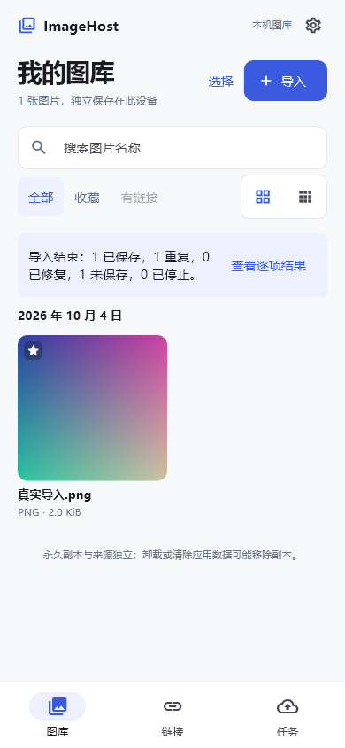
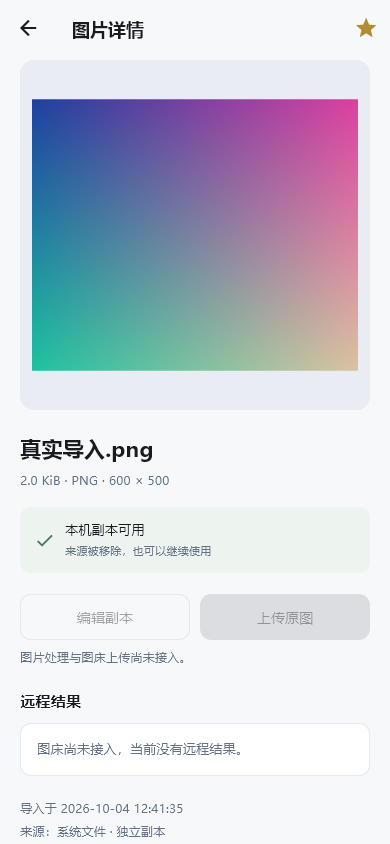

# M1 真实图库实现验收

日期：2026-10-04。用户接受 M1 优化方向后，将其接入 Flutter 真实业务。桌面 A 保留，资源包保持原样；本阶段没有安装软件、增加依赖或修改数据库 schema，也没有提交、推送或发布。

## 已实现

- Android/iOS 界面采用 M1：两列舒适/三列紧凑、真实导入日期分组、文件名/格式/字节数、图库/链接/任务三项导航。窄 Windows/macOS 窗口仍采用桌面 A。
- 复用共同导入流程：取得来源后保存独立永久副本，混合批次反馈已保存、重复、失败；未加载或打开失败时禁写，不伪造空库。照片入口仅在实际移动平台开放，平台授权流程仍需实机检查。
- 名称搜索、收藏筛选与持久收藏更新。搜索在数据库分页前执行，Unicode 大小写按 Dart 转换，百分号、下划线及引号作为普通字符；不是完整 LIB-005 检索实现。
- 按稳定 UUID 选择，切换筛选保留已选；全选当前匹配集包含未加载分页；核对面板读取真实名称，支持清空。搜索去抖等待期间暂停依赖当前结果的选择；不自动增加选择。
- 详情显示真实预览、格式/尺寸/字节数、导入时间和副本校验结果。永久原图与缩略图分离；来源删除后仍可查看；收藏写入失败保留原状态。
- 查询变化拒绝迟到分页，并发分页只执行一次；总数改变时重新取得首批，避免导入导致 offset 偏移而遗漏图片。

链接、任务、成功链接筛选、压缩/拼接/编辑/上传、图床账号、备份设置仍未接入，相关入口明确不可用。没有把原型模拟功能或固定样本移植到生产。

## 修改文件

| 文件 | 作用 |
| --- | --- |
| `app/lib/features/gallery/domain/gallery_query.dart`（新增） | 共同名称/收藏查询值 |
| `app/lib/features/gallery/data/library_repository.dart` | 数据库筛选、匹配计数/分页/UUID 集、按身份查询、事务收藏更新 |
| `app/lib/features/gallery/data/library_database.dart` | 每次打开注册纯小写函数；安全 PRAGMA 与 schema=1 保持 |
| `app/lib/features/gallery/presentation/gallery_providers.dart` | 查询控制器、分页时序与去重保护 |
| `app/lib/features/gallery/presentation/mobile_gallery.dart`（新增） | M1 导航、图库、选择集、详情及真实状态 |
| `app/lib/features/gallery/presentation/asset_widgets.dart`（新增） | 提取桌面原有预览与格式函数，手机紧凑错误态复用；桌面预览继续 contain |
| `app/lib/features/gallery/presentation/gallery_screen.dart` | 根据平台连接 M1 与共同导入流程，保留桌面 A |
| `app/test/core/gallery_query_test.dart`（新增） | 6 项真实数据库查询/收藏测试 |
| `app/test/gallery_controller_test.dart`（新增） | 真实串行仓库与故障钩子控制分页竞争 |
| `app/test/mobile_gallery_test.dart`（新增） | 7 项手机尺寸与真实资料库 widget 验证 |
| `app/test/widget_test.dart` | 明确 Windows 平台 variant，继续检查桌面及窄窗口 |
| `app/integration_test/mobile_gallery_flow_test.dart`（新增） | Windows 引擎上的 M1 布局、真实混合导入/收藏/重开及截图 |
| 根 `AGENTS.md`、`README.md`、`app/README.md`、`docs/architecture.md`、`environment.md`、`milestone-01.md` | 当前约定、运行与架构/平台边界；链接历史记录 |
| `docs/mobile-m1-design.md`、`design/mobile-m1/README.md`、`index.html` | 原型与生产实现状态说明 |
| `docs/validation/windows-engine-m1-{gallery,detail}.png`（新增） | 实际 Flutter 引擎截图，测试文件独立生成 |

工作区没有 Git，不能提供 git diff；主线程已检查实际文件、调用链、SQL 过滤及写入路径，并审阅测试和真实渲染。Sol 数据实现与 Sol 测试子代理均显式使用 `gpt-6.1-sol`、`high`，修改范围互不重叠；主线程完成 UI、集成与最终验收。

## 实际验证

| 命令 | 实际结果 | 说明 |
| --- | --- | --- |
| `flutter test --no-pub --reporter expanded` | exit0，52 项全部通过，约40秒 | 原有38 + 新增14；不是全部需求用例完成 |
| `flutter analyze --no-pub` | exit0，No issues found，13.9秒 | 生产、测试、集成与工具 |
| `dart format --output=none --set-exit-if-changed lib test integration_test tool` | exit0，26 文件，0变更 | 格式检查 |
| `flutter test integration_test/mobile_gallery_flow_test.dart -d windows --no-pub --reporter expanded` | exit0，1 项通过 | Windows 引擎、390×844 Android 主题；替换资源取得器，真实文件/SQLite/副本/重开/收藏 |
| `flutter test integration_test/gallery_flow_test.dart -d windows --no-pub --reporter expanded` | exit0，1 项通过 | 原有桌面 A 原生闭环回归 |
| `dart run tool/verify_process_recovery.dart` | exit0，全部 PASS | 6个突然退出边界、正常跨进程重开、Windows 排他锁与释放；不冒充硬件断电 |
| `node imagehost-new-project-kit/verify-kit.mjs` | exit0，31文件、56本地引用 | 资源包检查，不是应用测试 |
| `flutter build windows --release --no-pub` | exit0，44.9秒 | 当前 Windows Release 完整产物已更新，未制作安装包或发布 |

| 测试依据 | 实际覆盖与界限 |
| --- | --- |
| UT-016 部分 | 收藏/取消后重开保留，其他资产与名称、分类、版本、副本、原始字节不变；串行更新与无效/回收身份拒绝 |
| UT-017 部分 | 名称大小写/子串、字面通配符与引号、收藏交集、65 匹配+5 不匹配的过滤后分页/计数/稳定排序、重开；尚无标签/分类/图床等全条件 |
| UT-013 部分 | 选择跨筛选保留、真实名称核对、清空、65 条跨页全选；分页旧结果拒绝、重复调用保护及总数变化后 67 身份无遗漏 |
| UT-004 / IT-001 部分 | 新临时库真实文件导入，损坏和重复反馈；删除外部来源后详情可用；收藏保存；资料库和 ProviderContainer 关闭后新建会话重开，身份、版本、副本、字节数与收藏保留 |
| AT-001 部分 | 320/390/430 手机布局的加载/失败/空态，真实搜索无结果及清除，舒适/紧凑，导航保留滚动/查询，未实现动作禁用；桌面 1280/760/390 窄窗口回归 |

所有应用验证只使用独立新临时数据；未读取旧项目或旧应用库。主机 widget 与 M1 集成使用 Android 主题模拟，不能作为 Android/iOS 设备、权限、键盘、安全区、读屏、性能或最低版本验收。

本轮修正：导入期间分页总数变化会导致 offset 重叠/遗漏，改为刷新首批并验证全部身份；旧 widget 用例默认 Android，改用 Flutter 平台 variant 验证桌面；material_ui 返回按钮与 Flutter tester 的 pageBack 类型不一致，详情使用显式返回入口并真实点击。中途构建因之前的本项目 Release 窗口占用 sqlite3.dll 失败，正常关闭该窗口后重跑通过，未强制终止或删数据。

## 真实界面

以下来自 Windows 原生 Flutter 引擎、390×844 Android 主题布局，图片是集成测试生成并永久导入的 PNG。生产首次启动仍为空。

## 平台与下一阶段

Windows 可运行桌面 A；手机 M1 已接入源码和共同真实业务，但 Android 尚无 SDK/设备，macOS/iOS 缺 Mac/Xcode，因此没有三端构建或设备通过证据。原型预览服务继续保留，模拟范围说明不变。

下一阶段补手机工具链和真实系统资源选择/权限/生命周期验证，继续按需求实现分类、标签与完整检索，再推进图片处理与可靠保存、备份恢复、Catbox/ImgBB 和持久上传队列。任何新增软件、大型下载或系统配置仍须取得用户同意。
