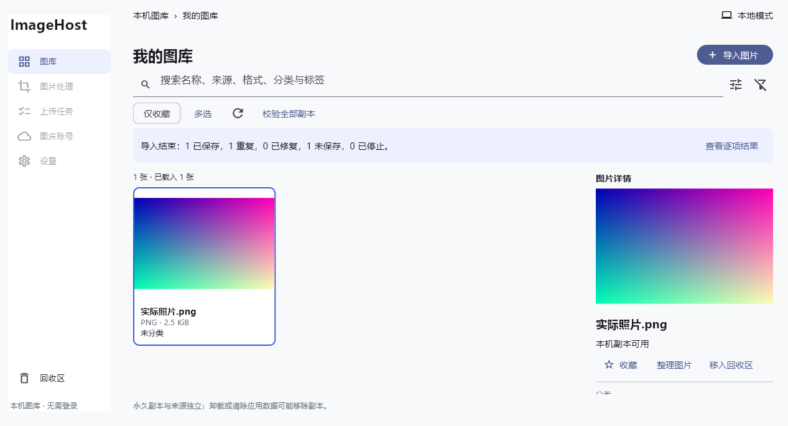
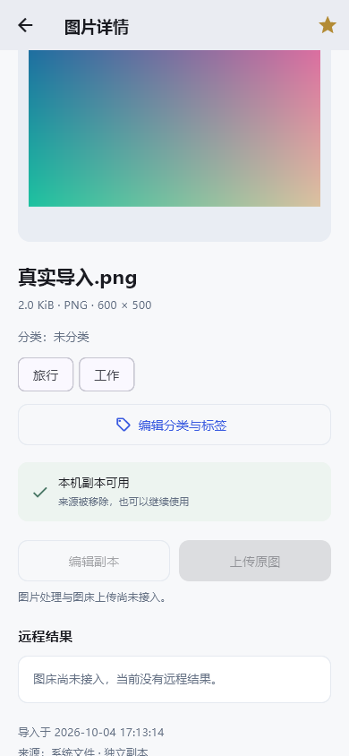

# Windows 图库整理、回收及共享处理基础

日期：2026-10-04。需求基线 IH-SRS-001 1.1；测试基线 IH-UTD-001 1.1；技术基线 IH-TS-001 1.0。

本阶段接续 Windows 全部 90 条 V1 开发目标，不是完整首版验收。资源包保留不变，没有读取旧项目、旧数据库或旧图片；没有提交、推送、发布或真实图床请求。

## 当前实际能力

- 桌面 A 接入真实分类管理、标签连续草稿、单项/批量整理、收藏、组合检索、名称/大小/导入时间排序、UUID 多选及全匹配核对。窄桌面保持 A，详情使用对话框。
- M1 详情和多选复用同一组织编辑器、TextPolicy 和持久化事务；已有导入、图库、搜索、收藏、选择集仍保留。
- 标签/分类提交时 trim、Unicode 17 NFC、完整默认 C/F 折叠、再次 NFC；按标量计 1–64 字符、最多 50 去重标签。草稿不截断、不吞分隔符。全批次校验先于任何元信息写入。
- 分类 UUID、标签 UUID 和关联表持久保存。新项目自身 schema 1→2 在事务内升级；规范化同名分类合并，原资产、版本和副本身份保留。非法分类或未来版本拒绝打开，原数据不被半升级或重置。
- 回收只改变资产状态；恢复保留身份和整理。30 天恰好到期仅计提示。永久记录、本机副本各自确认；共享版本、持久保护引用和文件使用租约阻止不安全清除。
- 仅清记录后保留的副本可被再次导入复用；新资产不继承已清记录的整理。副本缺失/损坏时可修复，不能替换正在被实际 IO 使用的路径。复用提交后的暂存清理由 committedReuse 日志保护。
- 资料库关闭先排空正在取得租约的操作，再等待实际 IO 结束释放租约；等待期间不占据串行协调门。重开取得独占锁后只清理前进程临时租约，不抹去持久依赖。
- ImageProcessor 是共同 isolate 像素引擎：五种静态输入、PNG/JPEG/静态 WebP 输出、压缩/裁剪/拼接、明确动画选帧、确认丢透明背景、正确方向、参数快照、真实体积比较、编码及写入校验、等待工作线程退出后取消清理。

**处理页和可靠输出生命周期尚未接入。** 引擎结果仍是临时文件；没有 OUT-001 的可重开输出记录、OUT-002 永久保存及来源关系、OUT-003 平台导出。因此处理入口继续禁用，不把底层测试写成完整处理交付。

## 真实验证

| 检查 | 实际结果与范围 | 证据 |
| --- | --- | --- |
| 完整现有 Flutter tests | 130 项通过，含参数化核心测试、20 处理测试组和 desktop/M1 widget；不等于 130 个完整正式 UT | [运行日志](validation/windows-v1-tests.log) |
| 静态检查 | Flutter analyze 无问题；格式检查 45 文件 0 改动；固定 Unicode 生成器 1585 C/F 映射核查通过 | [检查日志](validation/windows-v1-analyze.log) |
| 桌面 Windows 原生引擎 IT-001 | 1 项通过，真实独立副本、部分失败、去重、删除来源后可用、关闭库重开身份/字节保留 | [运行日志](validation/windows-desktop-v1-engine.log) |
| M1 布局 Windows 原生引擎 IT-001 子场景 | 1 项通过；真实导入、收藏、标签草稿提交、关闭库重开后标签和副本保留 | [运行日志](validation/windows-m1-v1-engine.log) |
| 独立进程恢复 | 六个 import 持久边界直接 exit(73) 后恢复通过，另正常跨进程重开及 Windows 排他锁/释放通过 | [运行日志](validation/windows-v1-process-recovery.log) |
| Windows Release | 构建通过，44.0 秒；保持 exe/DLL/data 整套产物 | [构建日志](validation/windows-v1-release.log) |
| Release 启动与退出 | 实际创建 Flutter 原生窗口，向本次进程窗口发送正常 WM_CLOSE，退出码 0 | [运行日志](validation/windows-v1-release-smoke.log) |
| 资源包 | verify-kit 通过，31 文件、56 本地引用；不是应用测试 | `node imagehost-new-project-kit/verify-kit.mjs` |

新增重点场景：整批 51 标签拒绝后资产和标签目录都不变；失效分类/资产不部分写入；Unicode 完整折叠与官方固定数据一致；组合查询计数/两页/全部 UUID 一致；真实缺失或字节损坏及重开；共享版本优先选择活跃资产；孤立副本重导入；使用租约阻止副本路径修复；清除日志前后恢复；租约取得与关闭之间的确定性竞态。

测试也实际发现并修复了以下问题：旧测试分类夹具直接写入名称而非新 UUID；GIF 量化夹具未保留预期红/蓝像素；格式筛选值大小写不匹配；移除当前筛选分类后的下拉框失效；组织编辑等待被误显示为后台进度；fake zone 与原生 SQLite 回调等待相互阻塞。修复后保留实际结果与像素断言，没有将预期改为错误实现。

Windows 主机 widget 的 390/760/1280 桌面、320/390/430 M1 布局，以及 Windows 引擎的 Android 主题均不代表 Android/iOS 实机通过。核心故障注入、进程退出和日志回放不能冒充硬件断电。系统真实选择器、普通窗口退出、键盘/读屏与参考负载 PERF/完整 AT 仍待验收。

## 视觉核查

下面是本次原生引擎实际截图；图片是独立生成并导入测试临时库的夹具，没有进入生产图库或复制 HTML 样本。

## 修改文件范围

| 边界 | 文件 |
| --- | --- |
| 共同文本规则 | `app/lib/core/text_policy.dart`、`unicode_case_folding.dart`、`app/tool/generate_case_folding.dart`、`app/tool/unicode/CaseFolding-17.0.0.txt` |
| 领域 | `app/lib/features/gallery/domain/{library_models,gallery_query,organization_models,recycle_models}.dart`；`app/lib/features/processing/domain/processing_models.dart` |
| 数据与文件保护 | `app/lib/features/gallery/data/{library_database,library_database.g,library_repository,library_organization,library_recycle}.dart`；`app/lib/core/platform_resource.dart` |
| 真实处理 | `app/lib/features/processing/application/{image_processor,metadata_policy}.dart` |
| 界面接线 | `app/lib/features/gallery/presentation/{gallery_providers,gallery_screen,desktop_gallery,library_organization_editor,mobile_gallery}.dart` |
| 验证 | `app/test/core/{text_policy,library_recycle,library_organization,library_migration,import_recycle_boundary,gallery_query,library_repository}_test.dart`；`app/test/{desktop_gallery,mobile_gallery}_test.dart`；`app/test/processing/image_processor_test.dart`；`app/integration_test/mobile_gallery_flow_test.dart` |
| Release 冒烟工具 | `app/tool/verify_release_smoke.ps1`：只检查本次启动的进程与窗口，正常关闭并校验退出码 |
| 依赖与文档 | `app/pubspec.yaml`、真实 `pubspec.lock`；根 `AGENTS.md`、两个 README；architecture/environment/coverage、本记录和 validation 证据 |

Drift 数据库代码由 build_runner 实际生成，未手写生成文件。当前没有 Git 仓库，不能给出 git diff；按真实文件和调用链审查，不初始化 Git。

## 剩余开发目标

1. 接入持久处理输出、来源版本关系、安全清理、永久入库和平台导出；再完成桌面处理页面、真实裁剪预览/调整和批量压缩。预算需要平台有效能力及实测，不把 256/512 MiB 候选值写成实测。
2. Catbox/ImgBB 能力与多账号、系统凭据存储、输入策略快照、发布尝试、取消晚到/未知结果、有限重试、真实任务队列、结果链接。开发与受控契约验证可继续；真实上传另取得授权。
3. 设置、诊断脱敏/导出、空间管理、两种备份与合并/替换恢复，以及 Windows 平台/性能/可访问性验收。90 条 V1 的 P0/P1 均不删减。

Android 尚无 SDK；macOS/iOS 仍需 Mac/Xcode/设备，未安装新工具或宣称三端可运行。共同 Dart 业务从本阶段复用，平台构建与实机证据分别登记。
