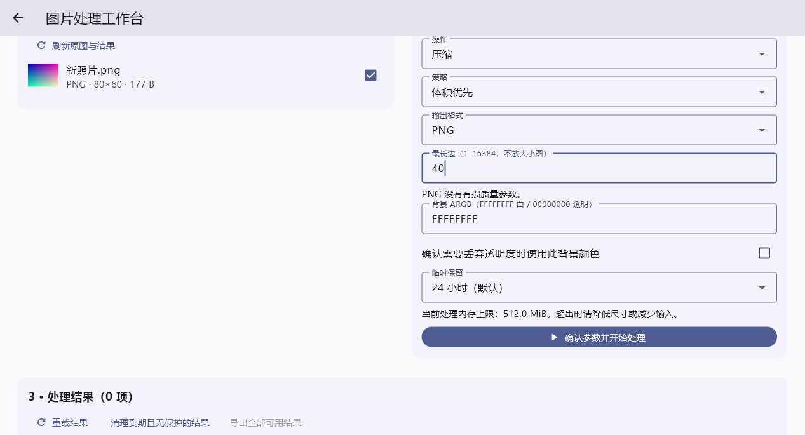
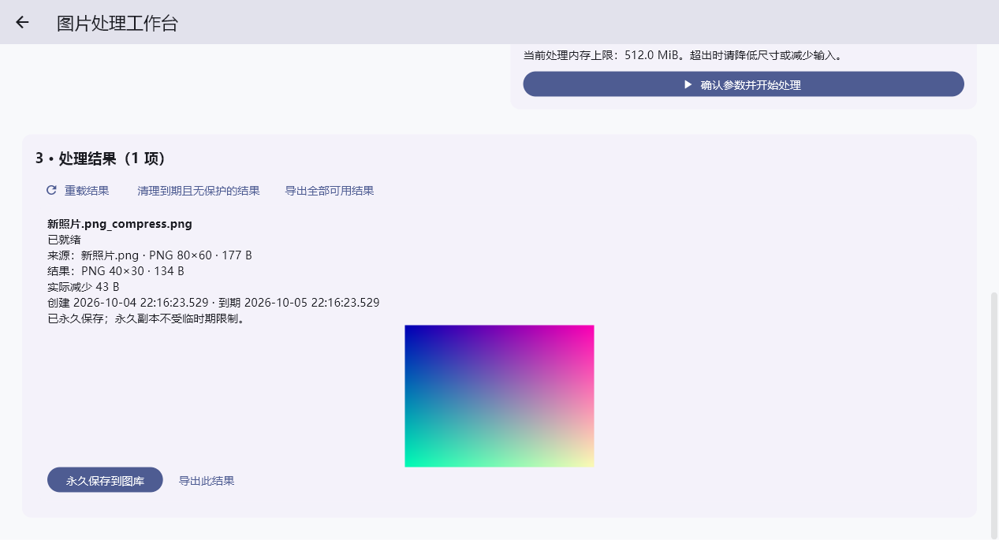

# Windows 处理、持久输出与真实导出

日期：2026-10-04。业务基线 IH-SRS-001 1.1；测试基线 IH-UTD-001 1.1；技术基线 IH-TS-001 1.0。

本阶段继续 Windows 完整 V1 的 90 条需求目标。处理闭环已有实际运行证据，完整首版仍未完成。资源包不变，未读取旧项目、旧库或旧图片；没有提交、推送、发布、系统安装或真实图床请求。

## 实际能力

- 桌面 A 的处理入口和 M1 的工具入口接入同一个工作台；压缩、整数像素裁剪和确认顺序拼接使用共同 isolate 引擎。参数、输入版本、动画选帧在执行前冻结，源文件保护持续到工作线程实际退出。
- 工作台展示真实文件、尺寸、格式、字节和处理结果；支持空态、加载失败、单项失败、取消和重载。动画预览与确认的处理帧一致；透明背景丢弃需要确认。PNG 不显示有损质量参数，体积增加按实际字节反馈。
- schema 3 的 15 张表持久保存输出 writing/prepared/ready/failed/cancelled/deleting、独立文件、摘要、来源和参数。保存相对管理路径，prepared 发布及删除中断有恢复日志，缺失或损坏不会提供可用文件或假成功。
- 新项目自身 schema 1/2→3 升级在事务内执行；保留资产、版本、副本、整理身份与内容。非法文本策略和未来版本拒绝打开，不重置有效数据；不涉及旧应用兼容。
- 结果默认保留 24 小时，可选 1 小时/7 天。启动及应用可运行期间每分钟尝试清理到期、无保护结果；持久引用、实际文件租约、在写结果及待提交永久保存阻止清除。删除失败保留记录重试，不承诺移动后台持续运行。
- 永久保存复用经过验证的导入提交协议，同一关联事务保存 SavedOutputOrigins。永久副本、资产整理及来源参数不依赖临时结果仍存在；重复保存不覆盖已有收藏等整理。
- 桌面选择导出目录，共同服务实际复制、关闭写入并核对 SHA-256 和长度。独占创建同名后缀，保留旧文件；单项失败不阻止其他项。取消后等待实际 IO 完成再释放保护，发生外部替换时保守保留文件。
- Android/iOS 复用共同业务和工作台，原生导出尚未接入，入口禁用。macOS 已配置用户所选文件读写 entitlement，尚无构建或设备证据。
- 可见页面负责系统退出监听，取消工作并等待实际 IO 后关闭库。数据库暂被占用而租约删除失败时，持久保护记录保留，但已结束的 IO 不会让资料库关闭无限等待；取得排他锁后重开可清理前进程临时租约。

512 MiB 桌面/256 MiB 移动处理预算仍是候选值，不是四端实测结论。Dart 文件 API 的检查和摘要不能证明对恶意外部路径替换的原子 no-follow/文件身份安全，平台级加固与实际权限测试仍需补证。

## 实际验证

| 检查 | 当前结果与边界 | 证据 |
| --- | --- | --- |
| 完整现有 Flutter tests | 168 项通过，含参数化核心及 desktop/M1/workbench widget；不是 168 个完整正式 UT | [完整日志](validation/windows-output-full-tests.log) |
| 输出与关闭保护专项 | 输出生命周期 16 项；与已有回收测试合跑共 37 项通过。真实外部 SQLite 写锁覆盖输入/输出租约释放失败、关闭及重开 | [专项日志](validation/windows-output-close-safety.log) |
| 导出专项 | 14 项包含关闭/摘要、同名竞争、单项失败、取消及保守清理；结果包含在完整 168 项中，不另累加 | [完整日志](validation/windows-output-full-tests.log) |
| 工作台与自身升级 | 6 个 widget 场景和 2 个 schema 2→3 场景包含在完整测试中；真实裁剪/拼接/保存，非法升级保留有效库 | [完整日志](validation/windows-output-full-tests.log) |
| Windows 原生引擎 IT-003 子流程 | 1 项通过：实际 80×60→40×30 PNG、真实导出同名保留、永久保存、关闭库重开、恰到期清理后永久副本可读 | [原生日志](validation/windows-output-integration.log) |
| 输出独立进程恢复 | 5 个输出边界和 1 个永久保存关联提交边界直接 exit(73) 后恢复，共 6 场景通过；重复重开身份与字节一致 | [输出恢复日志](validation/windows-output-process-recovery.log) |
| 现有导入独立进程恢复 | 六个导入边界、正常跨进程重开与 Windows 排他锁/释放通过，使用当前 schema 3 | [导入恢复日志](validation/windows-output-import-recovery.log) |
| 静态及格式检查 | Flutter analyze 无问题；58 文件格式检查 0 改动。两个 macOS entitlement XML 语法有效，不代表平台授权通过 | [静态](validation/windows-output-analyze.log)、[格式](validation/windows-output-format.log) |
| Windows Release | 最终构建通过，50.8 秒；实际创建本次进程的 Flutter runner 窗口，正常 WM_CLOSE 后退出码 0 | [构建](validation/windows-output-release.log)、[启动退出](validation/windows-output-release-smoke.log) |
| 资源包完整性 | 31 文件、56 本地引用通过；不是应用软件测试 | [检查日志](validation/windows-output-input-integrity.log) |

原生 IT 仅替换系统目录取得边界，导出服务、临时库、文件、摘要、保存和重开都是实际操作；不能作为 PT-003 真实目录选择窗口、拒绝权限或其他三端通过。独立进程直接退出及 SQLite 锁测试不能冒充硬件断电。各正式条款的剩余验证在 [动态验收台账](windows-v1-coverage.md) 中保留。

## 视觉核查

下面两张为当前 Windows 原生引擎截图，图片由测试独立生成后导入临时库，没有注入生产图库或复制 HTML 固定样本。主线程已检查选项、实际来源、结果尺寸/收益及永久保存反馈。

## 修改文件

| 边界 | 文件 |
| --- | --- |
| 输出与导出领域 | `app/lib/features/processing/domain/{output_models,export_models}.dart` |
| 处理协调及真实导出 | `app/lib/features/processing/application/{processing_coordinator,file_exporter}.dart` |
| 持久化与文件保管 | `app/lib/features/gallery/data/{library_database,library_database.g,library_repository,library_outputs,library_recycle}.dart`；`app/lib/core/{managed_file_store,image_inspector}.dart` |
| 平台适配 | `app/lib/platform/export_gateway.dart`；`app/macos/Runner/{DebugProfile,Release}.entitlements` |
| 共同工作台及入口 | `app/lib/features/processing/presentation/processing_workbench.dart`；`app/lib/features/gallery/presentation/{gallery_screen,desktop_gallery,mobile_gallery,gallery_providers,asset_widgets}.dart` |
| 核心及 widget 测试 | `app/test/processing/{output_lifecycle,file_exporter,processing_workbench}_test.dart`；`app/test/core/{output_schema_migration,library_migration}_test.dart` |
| 原生及恢复工具 | `app/integration_test/processing_flow_test.dart`；`app/tool/verify_output_recovery.dart`；已有 `verify_process_recovery.dart`/`verify_release_smoke.ps1` 本阶段复核 |
| 项目约定和证据 | 根 `AGENTS.md`、根及 app README；architecture/environment/coverage、本记录和 validation 日志/截图 |

Drift 代码由实际 build_runner 生成。工作区没有 Git 仓库，按真实文件和调用链审查，没有初始化仓库。主线程审查了数据保护、平台边界和界面接线，并执行上述验证。

## 剩余目标

1. Catbox/ImgBB 能力、多账号、系统凭据保护、持久发布队列与尝试、取消晚到/未知结果、有限重试、成功结果和链接流程。可以继续开发受控契约；真实上传或远端删除另需明确授权。
2. 两种备份、合并/替换恢复及数据身份隔离；设置、诊断脱敏、空间管理和完整生命周期。
3. Windows 系统选择窗口、键盘/读屏、资源负载/性能、完整 AT/PT；Android SDK 未安装，macOS/iOS 仍缺 Mac/Xcode 与设备。四端共同源码不等于四端已运行。

完整 V1 的 51 项 P0 与 39 项 P1 均继续保留；本阶段没有降低验收范围。
